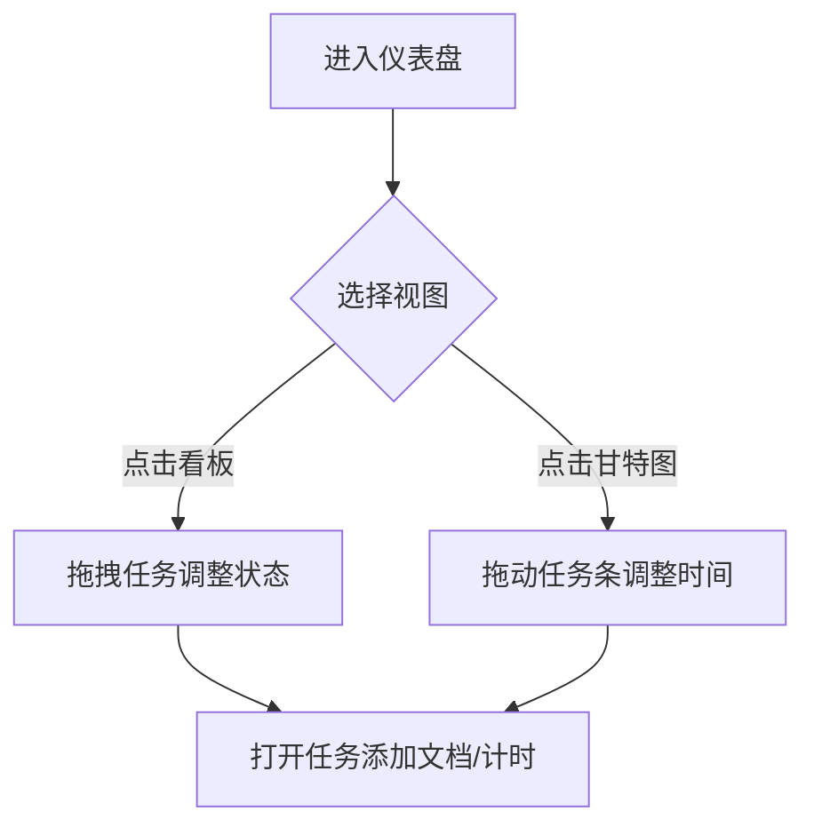

### 🚀 基于需求的完整技术方案

#### 1. 项目概述
构建单用户项目管理Web应用，支持**项目/任务管理+甘特图+文档存储+时间跟踪**，采用特斯拉风格深色科技风，提供**看板/甘特图双模式切换**。

---

#### 2. 核心功能清单
| 模块 | 功能点 |
|------|--------|
| **项目** | 创建/删除项目、项目描述、起止时间 |
| **任务** | 创建任务（标题/描述/负责人）、拖拽分配状态、设置依赖关系（可选） |
| **视图** | 看板模式（泳道式）、甘特图模式（时间轴） |
| **文档** | 文件上传（PDF/图片）、按项目归类文档 |
| **跟踪** | 任务计时器、总耗时统计 |
| **交互** | 一键切换视图模式、暗黑色玻璃态UI（特斯拉风格） |

---

#### 3. 技术规格
**▨ 前端（Vue.js + Tailwind CSS）**
| 页面组件 | 功能描述 |
|----------|----------|
| `ProjectDashboard.vue` | 主页（项目卡片网格+模式切换工具栏） |
| `KanbanView.vue` | 看板模式：拖拽任务卡片（状态列：待处理/进行中/完成） |
| `GanttChart.vue` | 甘特图模式：时间轴+任务条（可调整起止时间） |
| `TaskModal.vue` | 任务详情弹窗（设置依赖/计时器/上传文档） |

**▨ 用户流程**


**▨ 后端（Flask + SQLite）**
**API 设计**：
| 端点 | 方法 | 功能 |
|------|------|------|
| `/api/projects` | POST | 创建项目 {name, start_date, end_date} |
| `/api/projects/<id>/tasks` | POST | 创建任务 {title, status: 'todo', depends_on: null} |
| `/api/tasks/<id>` | PUT | 更新任务状态/时间/依赖 |
| `/api/tasks/<id>/documents` | POST | 上传文档（文件二进制） |
| `/api/tasks/<id>/timer` | POST | 计时器启停 {action: 'start/stop'} |

**数据模型**：
```python
# SQLite 表结构
Project(id, name, start_date, end_date)
Task(id, project_id, title, status, assignee, start_time, end_time, depends_on)
Document(id, task_id, filename, file_data)
TimeLog(id, task_id, start_time, duration)  # 计时记录
```

---

#### 4. 技术栈推荐（初学者友好）
| 分类 | 技术选择 | 理由 |
|------|----------|------|
| 前端 | Vue 3 + Vite + Tailwind CSS | 响应式组件开发 + 特斯拉风格实现便捷 |
| 状态管理 | Pinia | 比Vuex更简单的数据流管理 |
| 图表库 | Frappe Gantt | 轻量级甘特图（MIT协议） |
| 拖拽库 | Vue.Draggable | 看板拖拽最佳实践 |
| 后端 | Python Flask | 简单API开发 |
| 数据库 | SQLite | 单文件免部署 |
| 部署 | Vercel（前端） + Render（后端） | 免费托管方案 |

---

#### 5. 开发步骤分解
1. **环境搭建**
   - 前端：`npm create vite@latest` 选Vue+TS
   - 后端：`pip install flask flask-cors`

2. **特斯拉风格实现**（关键代码）
   ```css
   /* src/assets/tesla.css */
   :root {
     --glass-bg: rgba(20, 25, 35, 0.6); /* 深色玻璃背景 */
     --neon-border: 1px solid rgba(0, 200, 255, 0.3); /* 霓虹边框 */
   }
   .dashboard {
     background: radial-gradient(circle, #0f1b29 0%, #050a10 100%);
   }
   ```

3. **功能开发顺序**
   ```mermaid
   gantt
       title 开发阶段
       section 基础框架
       创建项目列表页 ：done, des1, 2023-08-01, 2d
       视图切换工具栏 ：active, des2, 2023-08-03, 1d
       section 看板模式
       拖拽任务卡片 ：des3, after des2, 3d
       状态实时保存 ：des4, after des3, 1d
       section 甘特图
       集成Frappe图表 ：des5, after des2, 2d
       任务条拖拽交互 ：des6, after des5, 2d
   ```